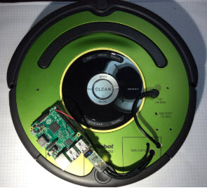

# iRobotCreate and Raspberry Pi

The iRobotCreate is a fantastic base platform for robotics clubs and classes. The Roomba is a familiar appliance in our society today. The 
Create is a genuine refurbished Roomba robot with a serial interface port. You can use a USB-to-serial dongle to control the
robot from your computer. Or mount a raspberry pi to the robot for a stand-alone mobile brain you connect to through wifi.

Here is the official documentation, version 1 hardware (old):

http://www.irobot.com/filelibrary/pdfs/hrd/create/Create%20Open%20Interface_v2.pdf

Version 2 hardware (current):

http://www.irobotweb.com/~/media/MainSite/PDFs/About/STEM/Create/iRobot_Roomba_600_Open_Interface_Spec.pdf

## Build the Robot

[Follow this guide](HARDWARE.md) to get your robot hardware running. The guide shows how to connect a Raspberry Pi to the iCreate1 and iCreate2.
The guide includes wiring diagrams and links to buy the parts.

## Learn the Software

[Follow this link](https://github.com/topherCantrell/robots-piCreate) to my Python library for controlling the create robot. The README shows how to 
install the software on you PC and Raspberry Pi. It shows how to connect remotely through wifi using Putty or the Eclipse IDE.

## Programming Challenges

[Follow this link](challenges) to a list of programming challenges for the students in your club/class. Contribute your own challenges back to community through
this repository.

